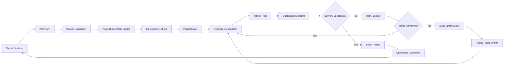
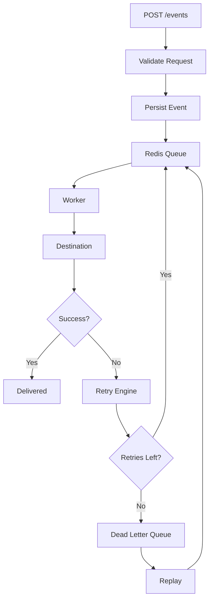
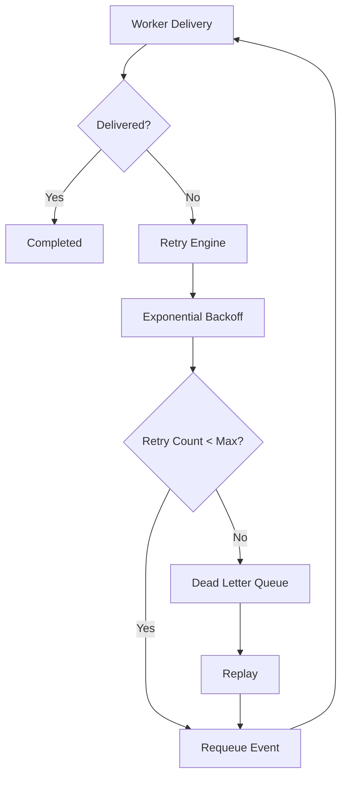
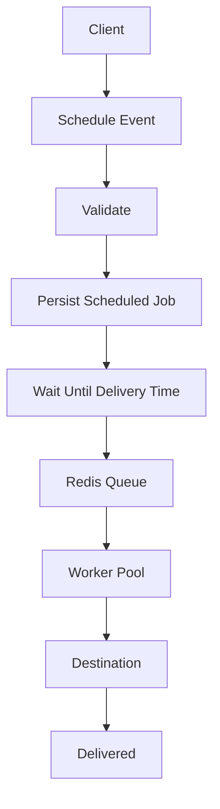
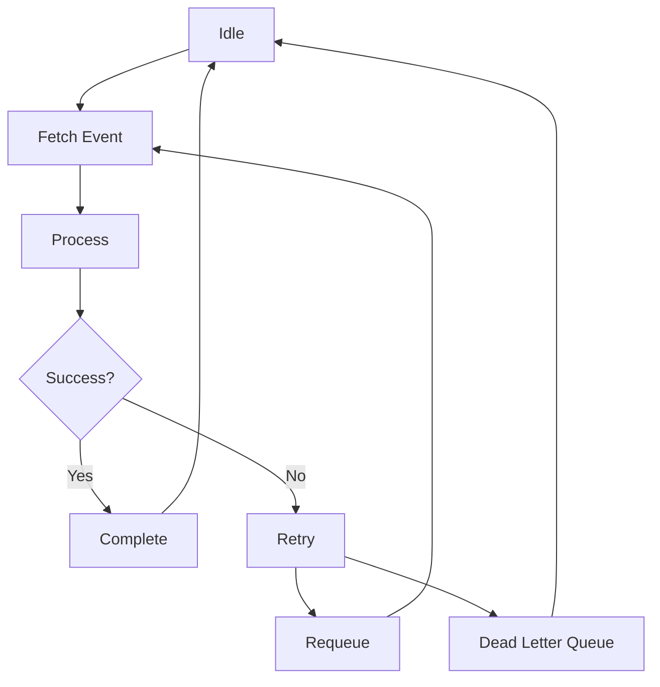

# EventRelay — Reliable Event Delivery Platform

<p align="center">

**An event delivery platform built with TypeScript implementing asynchronous event processing, Redis-backed queues, worker pools, retry policies, dead letter queues, scheduling, webhook authentication, observability and performance benchmarking.**

</p>

<p align="center">


</p>

---

# Live Demo

**[🚀 Try EventRelay Live](https://eventrelay-zce3.onrender.com)**

*The live demo includes the full interactive web dashboard. Developers can also interact directly with the underlying REST API using the same base URL.*

---

# Table of Contents

- [Overview](#overview)
- [Highlights](#highlights)
- [Why EventRelay?](#why-eventrelay)
- [Features](#features)
- [Architecture](#architecture)
- [Event Lifecycle](#event-lifecycle)
- [Retry Flow](#retry-flow)
- [Scheduler Flow](#scheduler-flow)
- [Worker Lifecycle](#worker-lifecycle)
- [Components](#components)
- [REST API](#rest-api)
- [Project Structure](#project-structure)
- [Benchmark Runner](#benchmark-runner)
- [Performance Evaluation](#performance-evaluation)
- [Complexity](#complexity)
- [Design Trade-offs](#design-trade-offs)
- [Quick Start](#quick-start)
- [Configuration](#configuration)
- [Testing](#testing)
- [Tech Stack](#tech-stack)
- [Cloud Infrastructure](#cloud-infrastructure)
- [Reliability Features](#reliability-features)
- [Operations Dashboard](#operations-dashboard)
- [Data Model](#data-model)
- [Design Decisions](#design-decisions)
- [Documentation](#documentation)
- [Future Improvements](#future-improvements)
- [Repository Goals](#repository-goals)
- [Acknowledgements](#acknowledgements)
- [License](#license)

---

# Overview

EventRelay is an educational backend systems project that demonstrates how modern asynchronous event delivery platforms are designed and implemented.

Rather than processing every request synchronously, EventRelay decouples producers and consumers through Redis-backed queues, allowing events to be processed independently by worker processes. This approach improves scalability, resilience and responsiveness while preventing slow downstream services from blocking client requests.

The project implements many reliability mechanisms commonly found in production event-driven systems, including retries with exponential backoff, dead letter queues, scheduling, idempotency, rate limiting, webhook authentication, metrics collection and structured observability.

An interactive Operations Dashboard provides real-time visibility into queue activity, worker status, retries, scheduling, benchmarking and overall system health.

---

# Highlights

- Production-inspired asynchronous event processing
- Redis-backed message queue using BullMQ
- Configurable concurrent worker pool
- Exponential retry engine
- Dead Letter Queue (DLQ)
- Event scheduling
- Idempotent request handling
- Token Bucket rate limiting
- HMAC webhook authentication
- JWT generation and verification
- Interactive Operations Dashboard
- Benchmark runner with configurable workloads
- Structured logging and metrics
- Dockerized multi-service deployment
- Automated component and API tests

---

# Why EventRelay?

Modern distributed applications rarely execute long-running work directly inside incoming HTTP requests.

Instead, requests are accepted quickly, validated and placed onto durable queues where independent workers process them asynchronously. This architecture allows applications to continue accepting new traffic even when downstream systems become slow or temporarily unavailable.

EventRelay explores the complete event delivery pipeline by implementing the core building blocks behind reliable backend systems.

The project covers:

- Event ingestion
- Request validation
- Queue management
- Concurrent worker processing
- Delivery retries
- Failure recovery
- Dead Letter Queue management
- Event scheduling
- Webhook authentication
- Metrics collection
- Performance benchmarking
- Operational observability

Instead of relying on managed cloud messaging services, EventRelay implements these concepts directly to provide a deeper understanding of how reliable event-driven platforms operate internally.

---

# Features

## Event Processing

- REST-based event ingestion
- Redis-backed asynchronous queue
- Configurable worker pool
- Event persistence
- Delivery tracking
- Event history
- Queue monitoring


## Reliability

- Exponential Backoff Retry Engine
- Dead Letter Queue (DLQ)
- Replay Failed Events
- Bulk DLQ Replay
- Failure Simulation
- Retry Monitoring

Retry progression

```text
Attempt 1
      │
      ▼
1 second

Attempt 2
      │
      ▼
2 seconds

Attempt 3
      │
      ▼
4 seconds

Attempt 4
      │
      ▼
8 seconds

Attempt 5
      │
      ▼
16 seconds

Retry Limit Reached
      │
      ▼
Dead Letter Queue
```


## Scheduling

- Delayed event execution *(Dashboard UI accepts delay in **seconds** for precise control)*
- Future event scheduling *(Absolute Datetime)*
- Scheduled job persistence
- Automatic queue integration


## Security

- HMAC SHA-256 webhook signing
- Webhook signature verification
- JWT generation
- JWT verification
- Request validation using Zod
- Security headers
- CORS support


## Event Safety

- Idempotent processing
- Correlation IDs
- Request IDs
- Delivery history
- Structured logs


## Performance

- Benchmark Runner
- Queue Metrics
- Throughput Measurement
- P50 Latency
- P95 Latency
- P99 Latency
- Queue Depth
- Worker Utilization


## Observability

- Operations Dashboard
- Queue Explorer
- Worker Pool Monitor
- Dead Letter Queue Manager
- Scheduler Viewer
- Live Logs
- System Metrics
- Performance Monitoring
- Failure Simulation Controls


## Utilities

- JWT Generator
- JWT Verification
- Webhook Tester
- Benchmark Runner
- Failure Simulation

---

# Architecture



---

# Event Lifecycle



---

# Retry Flow



---

# Scheduler Flow



---

# Worker Lifecycle



---

# Components

| Component | Responsibility |
|------------|----------------|
| REST API | Accepts event ingestion requests and exposes operational endpoints |
| Event Ingestion Service | Validates, persists and enqueues incoming events |
| Redis Queue | Buffers asynchronous work between producers and workers |
| Worker Pool | Processes queued events concurrently |
| Retry Engine | Applies exponential backoff and retry policies |
| Dead Letter Queue | Stores permanently failed events for inspection and replay |
| Scheduler Service | Executes delayed and scheduled events |
| Rate Limiter | Protects the API using a Token Bucket algorithm |
| Idempotency Layer | Prevents duplicate event processing |
| HMAC Module | Generates and verifies webhook signatures |
| JWT Utilities | Generates and validates authentication tokens |
| Metrics Service | Collects latency, throughput and utilization statistics |
| History Service | Tracks event lifecycle and delivery history |
| Benchmark Runner | Executes configurable performance workloads |
| Operations Dashboard | Provides operational visibility into the complete platform |

---

# REST API

| Method | Endpoint | Description |
|---------|----------|-------------|
| **POST** | `/events` | Submit an event for asynchronous delivery |
| **GET** | `/events/:id` | Retrieve event status and delivery history |
| **POST** | `/schedule` | Schedule an event for future delivery |
| **GET** | `/schedule` | Retrieve scheduled jobs |
| **GET** | `/queue` | Queue statistics and recent jobs |
| **GET** | `/workers` | Worker pool information |
| **GET** | `/metrics` | System metrics |
| **GET** | `/logs` | Fetch recent structured system logs |
| **GET** | `/dlq` | Retrieve Dead Letter Queue entries |
| **POST** | `/dlq/replay` | Replay selected failed events |
| **POST** | `/dlq/replay-all` | Replay all failed events |
| **DELETE**| `/dlq/:id` | Delete a specific event from the Dead Letter Queue |
| **DELETE**| `/dlq` | Clear the entire Dead Letter Queue |
| **GET** | `/simulation` | Retrieve current failure simulation configuration |
| **POST** | `/simulation` | Configure destination failure simulation |
| **POST** | `/simulate/destination`| Internal mock endpoint for failure/latency testing |
| **POST** | `/benchmarks/run` | Execute benchmark workload |
| **GET** | `/benchmarks` | Retrieve benchmark history |
| **DELETE**| `/benchmarks` | Clear benchmark history |
| **POST** | `/auth/token` | Generate JWT |
| **POST** | `/auth/verify` | Verify JWT |
| **POST** | `/signatures/hmac` | Generate HMAC signature |
| **POST** | `/webhooks/events` | Receive HMAC authenticated webhook events |
| **POST** | `/demo/reset` | Reset demo environment state |

---

# Project Structure

```text
EventRelay
│
├── benchmarks/
│   └── benchmark.ts
│
├── prisma/
│   ├── migrations/
│   └── schema.prisma
│
├── src/
│   ├── api/
│   ├── benchmark/
│   ├── config/
│   ├── dashboard/
│   ├── db/
│   ├── dlq/
│   ├── docs/
│   ├── history/
│   ├── logger/
│   ├── metrics/
│   ├── middleware/
│   ├── queue/
│   ├── rateLimiter/
│   ├── retry/
│   ├── scheduler/
│   ├── security/
│   ├── tests/
│   ├── workers/
│   ├── server.ts
│   └── types.ts
│
├── docker-compose.yml
├── Dockerfile
├── package.json
├── tsconfig.json
└── README.md
```

---

# Benchmark Runner

The Benchmark Runner evaluates EventRelay under configurable workloads to measure throughput, latency and overall system reliability across increasing traffic volumes.

Unlike synthetic microbenchmarks, workloads are executed against the complete event delivery pipeline including API ingestion, queueing, worker execution and persistence.

Supported workload presets

| Events |
|---------:|
| 100 |
| 500 |
| 1,000 |
| 2,500 |
| 5,000 |
| 10,000 |
| 25,000 |
| 50,000 |
| 100,000 |
| Custom |

The benchmark runner is fully integrated into the Operations Dashboard, allowing workloads to be executed without additional tooling.

---

# Performance Evaluation

Each benchmark records operational metrics collected from the running platform.

Metrics include:

- Events Processed
- Throughput (events/second)
- Average Latency
- P50 Latency
- P95 Latency
- P99 Latency
- Success Rate
- Retry Count
- Queue Depth
- Worker Utilization
- Total Execution Time


## Sample Benchmark Result

| Events | Throughput (events/s) | P95 Latency (ms) | Success Rate | Retries | Queue Depth | Total Time (ms) |
|--------:|----------------------:|-----------------:|-------------:|---------:|------------:|----------------:|
| 1000 | 140.83 | 10.36 | 100% | 0 | 0 | 7101 |

> Benchmark results vary depending on hardware configuration, worker concurrency and destination latency.

---

# Complexity

| Operation | Complexity |
|------------|------------|
| Event Ingestion | **O(1)** average |
| Queue Enqueue | **O(1)** |
| Queue Dequeue | **O(1)** |
| Idempotency Lookup | **O(1)** average |
| Rate Limiter | **O(1)** |
| Worker Scheduling | **O(log n)** |
| Retry Scheduling | **O(log n)** |
| Scheduled Job Lookup | **O(log n)** |
| Worker Processing | **O(1)** per event |
| DLQ Replay | **O(n)** |
| Metrics Collection | **O(1)** average |

---

# Design Trade-offs

The project intentionally favors clarity, reliability and educational value over excessive optimization.

### Redis for Queueing

Redis provides extremely low-latency queue operations and integrates naturally with BullMQ while remaining lightweight and simple to deploy.


### PostgreSQL for Persistence

Operational metadata is stored in PostgreSQL so that event history, delivery attempts, scheduled jobs and benchmark results survive service restarts.


### Worker-based Processing

Separating producers from consumers prevents slow downstream services from blocking incoming HTTP requests while allowing workers to scale independently.


### Exponential Backoff

Retry delays increase after every failed delivery attempt, reducing pressure on unstable downstream services while avoiding aggressive retry storms.


### Dead Letter Queue

Events that permanently fail are isolated rather than continuously blocking queue processing, allowing operators to inspect and replay them later.


### Idempotency

Duplicate requests are rejected before processing, preventing multiple deliveries caused by retries, client retransmissions or network failures.


### Token Bucket Rate Limiting

The API is protected using a Token Bucket algorithm, allowing controlled request bursts while maintaining predictable throughput.


### Docker-first Development

The complete platform—including PostgreSQL and Redis—can be started using a single Docker Compose command, simplifying environment setup across operating systems.

---

# Quick Start

## Prerequisites

- Node.js 20+
- Docker
- Docker Compose


## Start Entire Platform

```bash
npm run docker:up
```

This starts:

- EventRelay API
- Redis
- PostgreSQL

The dashboard becomes available at

```text
http://localhost:3000
```


## Stop Services

```bash
npm run docker:down
```


## View Logs

```bash
npm run docker:logs
```


## Local Development

Install dependencies

```bash
npm install
```

Generate Prisma Client and compile TypeScript

```bash
npm run build
```

Start the API

```bash
npm run dev
```

Start worker process

```bash
npm run worker
```

Start scheduler

```bash
npm run scheduler
```


## Docker Commands

Start platform

```bash
npm run docker:up
```

Stop platform

```bash
npm run docker:down
```

View logs

```bash
npm run docker:logs
```

These commands work consistently across Windows, macOS and Linux.

---

# Configuration

Configuration is managed through environment variables.

| Variable | Description |
|-----------|-------------|
| `PORT` | HTTP server port |
| `DATABASE_URL` | PostgreSQL connection string |
| `REDIS_URL` | Redis connection string |
| `JWT_SECRET` | Secret used for JWT signing |
| `WEBHOOK_SECRET` | Secret used for HMAC verification |
| `DESTINATION_URL` | Default destination endpoint |
| `WORKER_COUNT` | Number of workers |
| `WORKER_CONCURRENCY` | Concurrent jobs per worker |
| `MAX_RETRIES` | Maximum retry attempts |
| `BASE_DELAY_MS` | Initial retry delay |
| `RATE_LIMIT_RPS` | Token Bucket refill rate |
| `LOG_LEVEL` | Logging verbosity |

An `.env.example` file is included for quick setup.

---

# Testing

Run the complete automated test suite

```bash
npm test
```

Covered components include:

- REST API
- Queue Operations
- Retry Engine
- Dead Letter Queue
- Scheduler
- Token Bucket Rate Limiter
- Idempotency
- HMAC Security

Testing is implemented using **Vitest**, allowing individual modules to be validated independently of the running platform.


## Code Quality

Maintain code consistency using

Format source code

```bash
npm run format
```

Lint source code

```bash
npm run lint
```

Generate Prisma Client

```bash
npm run build
```

---

# Tech Stack

| Category | Technology |
|-----------|------------|
| Language | TypeScript |
| Runtime | Node.js |
| Framework | Express |
| Queue | BullMQ |
| Message Broker | Redis |
| Database | PostgreSQL |
| ORM | Prisma |
| Validation | Zod |
| Authentication | JSON Web Tokens (JWT) |
| Webhook Security | HMAC SHA-256 |
| Logging | Pino |
| Containerization | Docker & Docker Compose |
| Dashboard | HTML, CSS, Vanilla JavaScript (No Framework) |
| Testing | Vitest |

---

# Cloud Infrastructure

The live demo is deployed across a modern serverless cloud stack:

| Service | Provider | Purpose |
|---------|----------|---------|
| **Compute** | [Render](https://render.com) | Hosts the Node.js Express API and background worker processes. |
| **Database** | [Neon](https://neon.tech) | Serverless PostgreSQL for persistent operational state and event history. |
| **Queue** | [Aiven](https://aiven.io) | Valkey (Redis open-source fork) for low-latency BullMQ message brokering. |

### Production Deployment Notes
If you are deploying this stack yourself, note the following infrastructure requirements:

1. **Database Connection Pooling (Neon):** Under high concurrent load, workers will exhaust standard database connections. The application connects to PostgreSQL using a pooled connection (`?pgbouncer=true&connection_limit=80`). However, Prisma migrations require a direct connection. You must configure both `DATABASE_URL` (pooled) and `DIRECT_URL` (un-pooled) in your environment.
2. **Memory-Capped Transit Layer (Aiven):** To prevent Out-Of-Memory (OOM) crashes on free/constrained cloud tiers (500MB limits), the BullMQ queues are configured as a "Self-Cleaning Transit Layer" (`removeOnComplete: true`, `removeOnFail: true`). Valkey instantly purges jobs from RAM upon completion, while PostgreSQL acts as the durable storage layer for history and DLQ tracking.
3. **Worker Scaling:** On CPU-constrained cloud instances (e.g., Render Free Tier 0.1 CPU), it is highly recommended to scale concurrency per worker (e.g., `WORKER_CONCURRENCY=15`, `WORKER_COUNT=1`) rather than spinning up multiple Node.js processes to prevent excessive CPU context-switching.

---

# Reliability Features

EventRelay is designed around reliability rather than simple request processing.

The platform incorporates several mechanisms commonly found in production event-driven systems.

| Feature | Purpose |
|----------|---------|
| Redis-backed Queue | Decouples producers from consumers |
| Worker Pool | Enables concurrent event processing |
| Exponential Backoff | Prevents aggressive retries during downstream failures |
| Dead Letter Queue | Isolates permanently failed events |
| Replay Support | Allows failed events to be processed again |
| Scheduling | Supports delayed and future event delivery |
| Idempotency | Prevents duplicate processing |
| Token Bucket Rate Limiter | Protects the API from traffic spikes |
| HMAC Verification | Authenticates incoming webhook requests |
| JWT Utilities | Authentication and testing utilities |
| Metrics Collection | Provides operational visibility |
| Structured Logging | Improves debugging and traceability |

---

# Operations Dashboard

EventRelay includes a browser-based Operations Dashboard that provides real-time visibility into the platform.

Available modules include:

- Overview
- Events
- Processing
- Scheduler
- Dead Letter Queue
- Observability
- Live Logs
- Utilities
- Webhook Tester

The dashboard allows operators to:

- Create events
- Inspect event history
- Schedule future deliveries
- Monitor queue activity
- Monitor worker utilization
- Configure destination failure simulation
- Replay failed deliveries
- Execute performance benchmarks
- Generate and verify JWTs
- Generate HMAC webhook signatures
- Observe real-time platform metrics
- Reset demo state (while safely persisting benchmark history)

*The interface is designed with a premium, framework-free UX featuring **inline copy-to-clipboard** utilities and **frosted glass modal dialogs**.*

---

# Data Model

The persistence layer stores operational state independently from transient queue state.

Primary entities include:

| Entity | Purpose |
|---------|---------|
| Event | Core event metadata |
| Delivery | Individual delivery attempts |
| Event History | Lifecycle tracking |
| Scheduled Job | Future event execution |
| Benchmark Run | Benchmark execution history |

Redis stores transient queue state while PostgreSQL persists operational data and historical records.

---

# Design Decisions

Several architectural decisions were intentionally made to emphasize reliability, modularity and operational simplicity.

### Asynchronous Processing

Incoming requests are acknowledged quickly while event processing is delegated to background workers. This prevents downstream latency from impacting API responsiveness.


### Queue-backed Architecture

Redis and BullMQ provide a lightweight yet reliable mechanism for decoupling producers from consumers.


### Worker Pool

Worker concurrency can be scaled independently from the REST API, allowing processing throughput to increase without modifying ingestion logic.


### Persistent Operational State

Operational information such as delivery history, scheduled jobs and benchmark runs is persisted separately from the queue to improve recoverability and observability.


### Failure Isolation

Retries and Dead Letter Queues isolate downstream failures without interrupting unrelated event processing.


### Dashboard-first Observability

Operational metrics are surfaced through an interactive dashboard, enabling inspection of queue state, worker activity and system health without external tooling.

### Self-Cleaning Transit Layer
To operate safely within strict cloud memory limits (500MB), the queue acts purely as a high-speed transit layer. Completed and failed jobs are instantly purged from Valkey's RAM the millisecond they finish. PostgreSQL serves as the durable storage layer, retaining all historical logs, delivery attempts, and Dead Letter Queue states. This guarantees zero memory leaks during massive benchmark bursts.


### Modular Architecture

Major platform responsibilities are separated into independent modules including:

- API
- Queue
- Workers
- Retry Engine
- Scheduler
- Metrics
- Security
- Dashboard

This improves maintainability while reducing coupling between components.

---

# Documentation

Additional engineering documentation is included within the repository.

Topics include:

- System Architecture
- Database Design
- API Documentation
- Benchmark Methodology
- Design Notes

---

# Future Improvements

Potential future extensions include:

## Reliability

- Priority Queues
- Event Expiration (TTL)
- Circuit Breakers
- Exactly-once Processing
- Poison Message Detection


## Scalability

- Distributed Worker Nodes
- Horizontal Queue Scaling
- Topic-based Routing
- Multi-region Deployment
- Queue Sharding


## Observability

- Prometheus Metrics
- Grafana Dashboards
- OpenTelemetry Tracing
- Alerting
- Persistent Log Storage


## Platform

- Kubernetes Deployment
- WebSocket-based Live Dashboard Updates
- Role-based Access Control
- API Versioning
- Event Versioning

---

# Repository Goals

EventRelay was developed as an educational systems project to explore the design and implementation of reliable asynchronous event delivery platforms.

The project focuses on understanding the architectural principles behind modern backend infrastructure rather than relying on managed cloud messaging services.

Primary goals include:

- Understanding asynchronous system design
- Implementing reliability mechanisms from first principles
- Exploring operational observability
- Building production-inspired backend architecture
- Demonstrating distributed systems concepts in a self-contained project

---

# Acknowledgements

This project builds upon ideas commonly found in modern distributed systems and event-driven architectures.

Special thanks to the maintainers of the open-source ecosystem including:

- Node.js
- Express
- BullMQ
- Redis
- PostgreSQL
- Prisma
- Vitest
- Zod

for providing the foundations used throughout the project.

---

# License

This project is licensed under the MIT License.

See the `LICENSE` file for additional information.