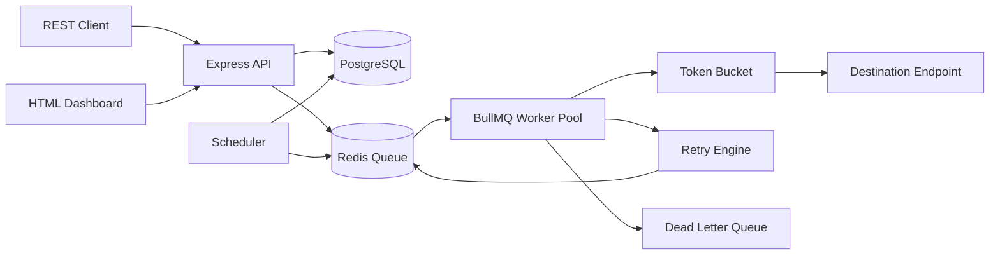

# Architecture

EventRelay persists first, queues second, and records every status transition in event history. Delivery is idempotent by `event_id`; workers skip events already marked `DELIVERED` with `processedAt`.
